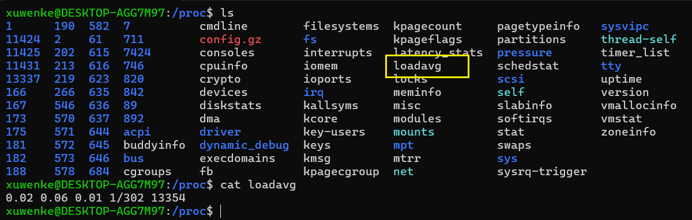
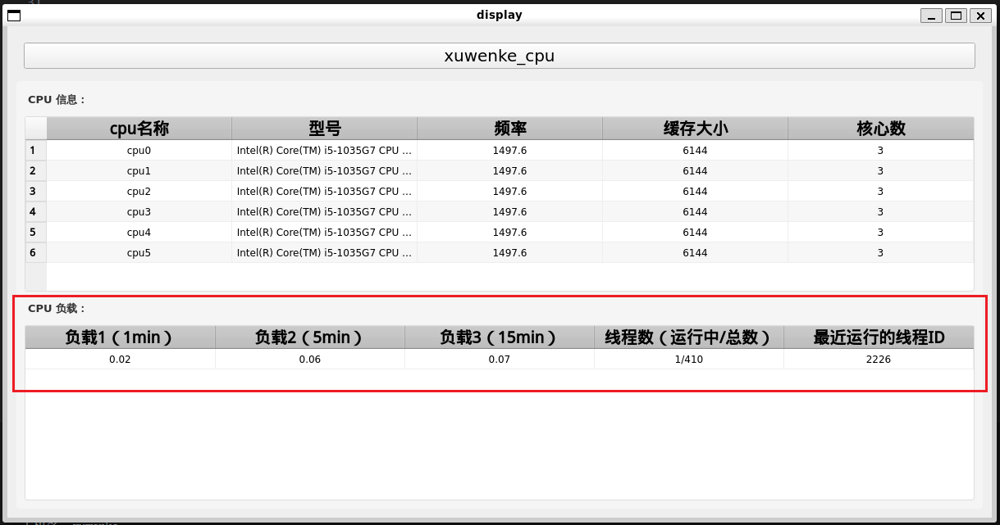

# LinuxServerMonitor项目介绍

本项目是我自身在学习和实习期间，将所见所学整理的一套服务器监控软件。使用的`C++`，`grpc`，`shell` , `docker` ，`proto` ，`cmake` ,`git` ，`gtest` 等技术，旨在进一步掌握C++软件开发流程，补足自己的短板。

# 一、结构

```
.
├── CMakeLists.txt          # 根目录总控
├── proto/
│   └── CMakeLists.txt      # Protobuf 代码生成
├── rpc_manager/
│   ├── client/
│   │   └── CMakeLists.txt  # 客户端模块
│   └── server/
│       └── CMakeLists.txt  # 服务端模块
├── utils/
│   └── CMakeLists.txt      # 工具库
├── test/
│   └── CMakeLists.txt      # 测试模块
└── monitor_view/
    └── CMakeLists.txt      # 监控界面模块（可选）
```

# 二、流程结构

```
┌───────────────────────────────────────────────────────────────────┐
│                           客户端(电脑A)                            │
│  ┌───────────────┐     ┌───────────────────────────────────────┐  │
│  │    Qt界面层    │◄───►│           gRPC客户端层                │  │
│  │ (主窗口/图表)  │     │        (异步请求/响应处理)             │  │
│  └───────────────┘     └──────────────────┬────────────────────┘  │
│                                           │                       │
│                                           ▼                       │
│  ┌─────────────────────────────────────────────────────────────┐  │
│  │                      Protobuf数据模型                        │  │
│  │            (CPUInfo消息定义/序列化/反序列化)                  │  │
│  └─────────────────────────────────────────────────────────────┘  │
└───────────────────────────────────────────────────────────────────┘
                                            ▲
                                            │
                                            ▼
┌───────────────────────────────────────────────────────────────────┐
│                           服务器集群(servers)                      │
│  ┌────────────────────────┐  ┌───────────────────────────────┐    │
│  │      gRPC服务端        │  │     系统信息收集模块            │    │
│  │(接收请求/返回数据)     │◄──►│(获取CPU信息/内存/负载等)       │    │
│  └────────────────────────┘  └───────────────────────────────┘    │
│                                                                   │
│  ┌─────────────────────────────────────────────────────────────┐  │
│  │                      Protobuf数据模型                        │  │
│  │(与客户端共享相同的proto文件)                                  │  │
│  └─────────────────────────────────────────────────────────────┘  │
└───────────────────────────────────────────────────────────────────┘
```

# 三、各个模块介绍

utils模块：[utils](./utils/README.md ":include :type=markdown")

proto模块：[proto](./proto/README.md ":include :type=markdown")

# 四、docker构建环境

```shell
cd docker/scripts
# 创建镜像
./docker_build.sh
# 创建容器
./monitor_docker_run.sh
# 进入容器
./monitor_docker_into.sh
# 删除容器
./docker_rm_container.sh
# 删除镜像
./docker_rm_image.sh
```

# 五、编译项目

```shell
./monitor_docker_into.sh
cd work/build
cmake ..
make -j6
```

# 六、添加新的模块流程

由于精力和时间问题，本项目没有对Linux系统中的所有资源进行监控，只是对经常接触使用到的资源进行了监控。本项目是我在实习期间结合自己的所见所学，设计的一套代码，代码结果设计的比较合理（我目前的水平），各个模块之间的耦合度很低。所以你如果想要动手实现自己的模块，可以按照下面的流程来添加自己的代码。

接下来以实现监控 `/proc/loadavg` ，在linux系统中，该文件存储了cpu的平均负载情况，



**0.02** → 最近 **1 分钟** 的平均负载（load average）

**0.06** → 最近 **5 分钟** 的平均负载

**0.01** → 最近 **15 分钟** 的平均负载

**1/302** →

- **1**：当前正在运行（runnable）的进程数
- **302**：系统中总的进程数（包括运行、睡眠、僵尸等状态）

**13354** → 最近运行的进程的 PID（进程 ID）

## 6.1添加自定义proto协议接口

根据上面的介绍，cpu loadavg有五个字段，六个项目，分别是：最近一分钟的平均负载、最近五分钟的平均负载、最近十五分钟的平均负载、当前正在运行的进程数、系统中的总进程数和最近运行的进程PID

所以proto需要设置5个字段来存储上述变量。在`proto` 目录下新建`cpu_load.proto` ，内容如下：

```shell
syntax="proto3";
package monitor.proto;

// 系统负载信息
message CpuLoad {
  double load1 = 1;         // 最近1分钟平均负载
  double load5 = 2;         // 最近5分钟平均负载
  double load15 = 3;        // 最近15分钟平均负载
  string running_total = 4; // 当前运行/总进程数，例如 "1/302"
  uint32 last_pid = 5;      // 最近运行的进程PID
}
```

然后将CpuLoad添加到monitor.proto中，如下所示：

```shell
syntax = "proto3";
package monitor.proto;

import "google/protobuf/empty.proto";
import "cpu_info.proto";
import "cpu_load.proto";				// 首先导入

message MonitorInfo {
    string name = 1;                    // monitor名字
    repeated CpuInfo cpu_info = 2;      // cpu信息，repeated表示cpu_info是一个列表，用于多cpu系统
    CpuLoad cpu_load = 3;				// 然后添加
}
```

修改proto文件夹下的CMakeLists.txt文件：

```shell
set(PROTO_FILES
    ${PROTO_DIR}/monitor.proto
    ${PROTO_DIR}/cpu_info.proto
    ${PROTO_DIR}/cpu_load.proto  # 添加
)
```


这样自定义传输接口协议就写好了。在编译时，会自动编译生成`cpu_load.grpc.pb.h、cpu_load.grpc.pb.cc、cpu_load.pb.h、cpu_load.pb.cc`。


## 6.2 监测代码实现

在monitor目录下创建两个文件`CpuLoadMonitor.hpp` 和`CpuLoadMonitor.cpp` 来实现监测代码。

在CpuLoadMonitor中重写MonitorBase::UpdateOnce函数，该函数是一个接口，是为了统一开发风格，方便集成不同Linux模块。

```cpp
/// @brief 监测 /proc/loadavg
/// @param monitor_info
void CpuLoadMonitor::UpdateOnce(monitor::proto::MonitorInfo * monitor_info) {
    std::ifstream cpuload_file("/proc/loadavg");
    if (!cpuload_file.is_open()) {
        Logger::getInstance().error("open the file /proc/loadavg fail.");
        return;  // 文件打开失败
    }

    std::string file_content((std::istreambuf_iterator<char>(cpuload_file)),  // 开始迭代器
                             std::istreambuf_iterator<char>()                 // 结束迭代器
    );

    std::vector<std::string> result;
    util::StringUtil::split(file_content, std::string(" "), result);

    if (result.size() < 5) {
        Logger::getInstance().error("invalid /proc/loadavg format.");
        return;
    }

    CpuLoad cpu_load;
    cpu_load.load1         = std::stod(result[0]);
    cpu_load.load2         = std::stod(result[1]);
    cpu_load.load3         = std::stod(result[2]);
    cpu_load.running_total = result[3];  // 保留 "1/302" 原样
    cpu_load.last_pid      = static_cast<uint32_t>(std::stoul(result[4]));

    // 这里可以把 cpu_load 写入 proto
    auto * loadavg_proto = monitor_info->mutable_cpu_load();
    loadavg_proto->set_load1(cpu_load.load1);
    loadavg_proto->set_load5(cpu_load.load2);
    loadavg_proto->set_load15(cpu_load.load3);
    loadavg_proto->set_running_total(cpu_load.running_total);
    loadavg_proto->set_last_pid(cpu_load.last_pid);
}
```

该函数实现了从要监控的服务器中读取/proc/loadavg文件，然后将读取的内容存储在CpuLoad结构体中，并在Monitor.cpp中调用。


在Monitor.cpp中调用该函数，需要包含CpuLoadMonitor.hpp，并在runners里添加该对象：

```cpp
#include "CpuLoadMonitor.hpp"

runners.emplace_back(std::make_shared<monitor::CpuLoadMonitor>());
```


修改monitor文件夹下的CMakeLists.txt文件：

```cmake
set(MONITOR_SOURCE
    ${CMAKE_CURRENT_SOURCE_DIR}/monitor.cpp
    ${CMAKE_CURRENT_SOURCE_DIR}/src/CpuInfoMonitor.cpp
    ${CMAKE_CURRENT_SOURCE_DIR}/src/CpuLoadMonitor.cpp  # 添加
)
```


## 6.3 QT页面设计

在display文件夹下创建`QCpuLoadModel.hpp` 和 `QCpuLoadModel.cpp` 文件，用于处理数据。

首先需要重写相关函数：

```cpp
#ifndef Q_CPU_LOAD_MODEL_
#define Q_CPU_LOAD_MODEL_

#include "Logger.hpp"
#include "monitor.grpc.pb.h"
#include "QMonitorBase.hpp"

#include <QAbstractTableModel>
#include <vector>

namespace monitor {

class QCpuLoadModel : public QMonitorBase {
    Q_OBJECT

  public:
    explicit QCpuLoadModel(QObject * parent = nullptr);

    virtual ~QCpuLoadModel() {}

    // 返回表格的行数
    int      rowCount(const QModelIndex & parent = QModelIndex()) const override;
    // 返回表格的列数
    int      columnCount(const QModelIndex & parent = QModelIndex()) const override;
    // data 返回指定索引和角色的数据
    QVariant data(const QModelIndex & index, int role = Qt::DisplayRole) const override;
    // cloumn name 返回表格表头的数据
    QVariant headerData(int section, Qt::Orientation orientation, int role) const override;

    void updateMonitorInfo(const monitor::proto::MonitorInfo & monitor_info);

  signals:


  private:
    std::vector<QVariant>              insertOneCpuLoad(const monitor::proto::CpuLoad & cpu_info);
    std::vector<std::vector<QVariant>> monitor_data_;
    QStringList                        header_;

    enum CpuLoad { LOAD1 = 0, LOAD5, LOAD15, RUNNING_TOTAL, LAST_PID, COLUMN_MAX };
};

}  // namespace monitor

#endif
```

- rowCount和columnCount函数是重写QT表格的行数和列数函数；
- data函数为渲染数据到表格的函数；
- headerData函数为设置表头的函数；
- updateMonitorInfo函数为定时更新表格数据的函数。

```cpp
#include "QCpuLoadModel.hpp"

namespace monitor {

QCpuLoadModel::QCpuLoadModel(QObject * parent) {
    header_ << tr("负载1（1min）");
    header_ << tr("负载2（5min）");
    header_ << tr("负载3（15min）");
    header_ << tr("线程数（运行中/总数）");
    header_ << tr("最近运行的线程ID");
}

int QCpuLoadModel::rowCount(const QModelIndex & parent) const {
    return monitor_data_.size();
}

int QCpuLoadModel::columnCount(const QModelIndex & parent) const {
    return COLUMN_MAX;
}

QVariant QCpuLoadModel::data(const QModelIndex & index, int role) const {
    if (index.column() < 0 || index.column() >= COLUMN_MAX) {
        return QVariant();
    }

    if (role == Qt::DisplayRole) {
        if (index.row() < monitor_data_.size() && index.column() < COLUMN_MAX) {
            return monitor_data_[index.row()][index.column()];
        }
    } else if (role == Qt::TextAlignmentRole) {
        return Qt::AlignCenter;  // 关键代码：设置居中
    }
    return QVariant();
}

QVariant QCpuLoadModel::headerData(int section, Qt::Orientation orientation, int role) const {
    if (role == Qt::DisplayRole && orientation == Qt::Horizontal) {
        return header_[section];
    }

    return QMonitorBase::headerData(section, orientation, role);
}

void QCpuLoadModel::updateMonitorInfo(const monitor::proto::MonitorInfo & monitor_info) {
    beginResetModel();
    monitor_data_.clear();

    monitor_data_.push_back(insertOneCpuLoad(monitor_info.cpu_load()));

    endResetModel();
}

std::vector<QVariant> QCpuLoadModel::insertOneCpuLoad(const monitor::proto::CpuLoad & cpu_load) {
    std::stringstream ss;
    ss << "CPU LOAD of QCpuLoadModel.cpp: "
       << "load1: " << cpu_load.load1() << ", "
       << "load5: " << cpu_load.load5() << ", "
       << "load15: " << cpu_load.load15() << ", "
       << "running_total: " << cpu_load.running_total() << ", "
       << "last_pid: " << cpu_load.last_pid();
    Logger::getInstance().info(ss.str());

    std::vector<QVariant> cpu_load_list;
    cpu_load_list.emplace_back(cpu_load.load1());
    cpu_load_list.emplace_back(cpu_load.load5());
    cpu_load_list.emplace_back(cpu_load.load15());
    cpu_load_list.emplace_back(QString::fromStdString(cpu_load.running_total()));
    cpu_load_list.emplace_back(static_cast<uint>(cpu_load.last_pid()));
    return cpu_load_list;
}
}  // namespace monitor

```


## 6.4 集成到总页面

在`QMonitorMainWidget.hpp` 中定义`QTableView * cpu_load_view_ = nullptr;` 和`QCpuLoadModel * cpu_load_model_ = nullptr;` 

在 `QMonitorMainWidget.cpp` 中修改函数以添加CPU 负载展示界面：

```cpp
QWidget * QMonitorMainWidget::initCpuMonitorWidget() {
    // 创建顶层容器，指定父对象以便 Qt 自动析构
    QWidget * page = new QWidget(this);
    page->setObjectName("cpuMonitorPage");
    page->setStyleSheet("#cpuMonitorPage { background-color: #f5f5f5; border-radius: 4px; }");

    // 统一字体设置
    QFont labelFont("Microsoft YaHei", 10, QFont::Bold);
    QFont tableFont("Microsoft YaHei", 9);

    // ==================== CPU 信息区域 ====================
    QLabel * cpuInfoLabel = new QLabel(tr("CPU 信息："), page);
    cpuInfoLabel->setFont(labelFont);
    cpuInfoLabel->setStyleSheet("color: #333333; padding: 4px 0;");

    cpu_info_view_  = new QTableView(page);
    cpu_info_model_ = new QCpuInfoModel(this);
    cpu_info_view_->setModel(cpu_info_model_);

    // 表格样式设置
    setupTableViewStyle(cpu_info_view_, tableFont);

    // ==================== CPU 负载区域 ====================
    QLabel * cpuLoadLabel = new QLabel(tr("CPU 负载："), page);
    cpuLoadLabel->setFont(labelFont);
    cpuLoadLabel->setStyleSheet("color: #333333; padding: 4px 0;");

    cpu_load_view_  = new QTableView(page);
    cpu_load_model_ = new QCpuLoadModel(this);
    cpu_load_view_->setModel(cpu_load_model_);

    // 表格样式设置（复用通用配置）
    setupTableViewStyle(cpu_load_view_, tableFont);
    cpu_load_view_->verticalHeader()->setVisible(false);  // 只有一行，隐藏行号

    // ==================== 布局设置 ====================
    QGridLayout * layout = new QGridLayout(page);
    int           row    = 0;

    layout->addWidget(cpuInfoLabel, row, 0);
    layout->addWidget(cpu_info_view_, row + 1, 0, 1, 2);
    row += 2;

    layout->addWidget(cpuLoadLabel, row, 0);
    layout->addWidget(cpu_load_view_, row + 1, 0, 1, 2);
    row += 2;

    // 布局边距和间距设置
    layout->setContentsMargins(10, 10, 10, 10);
    layout->setVerticalSpacing(8);
    layout->setHorizontalSpacing(5);

    return page;
}

```

修改display文件夹下的CMakeLists.txt，将上面添加的头文件和源文件路径添加到`DISPLAY_HEADER` 和  `DISPLAY_SOURCE` 中。代码编写完毕，编译运行。




